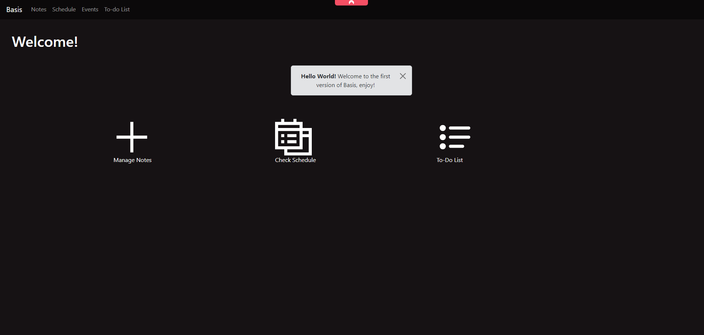

# 📅 **Basis** – Schedule, Note-Taking & ToDoList App



Welcome to **Basis**! This application is a sleek, intuitive schedule and note-taking tool designed to keep your daily tasks, projects, and important notes organized. Whether you're managing personal goals or team projects, this app is here to help streamline your workflow.

---

## 🚀 **Features**

### ✍️ **Note-Taking:**
- Create, edit, and delete notes effortlessly.
- Organize notes under specific **Subjects** and **Topics** for easy reference.
- Auto-save functionality to ensure you never lose your important thoughts.
- Rich text editor with formatting options for better readability.

### 📅 **Schedule Management:**
- Create and manage schedules for your daily, weekly, and monthly tasks.
- Display schedules based on the current day.
- Add new tasks to specific days, with color indicators for better visual management.
- Real-time updates for tasks using **auto-refresh** every 5 seconds.
  
### 🔍 **ToDo Listy:**
- Powerful management to create a task list for your rotine.
- Filter task, add and delete with specific dates.

### 🌐 **Web & Desktop Compatibility:**
- Built with **React** and **Electron**, the app works both in your web browser and as a desktop app.
  
### 📅 **Schedule Import/Export:**
- Import your existing schedules or export them for sharing with your team.
  
### 🎨 **Customizable UI:**
- Switch between light and dark themes based on user preferences.
- Fully responsive design – works seamlessly on desktop, tablet, and mobile devices.

---

## 🛠️ **Tech Stack**

- **Frontend:** React, Bootstrap
- **Backend:** Node.js, Express
- **Database:** MongoDB (for notes and subjects) + JSON (for schedules)
- **Hosting:** Raspberry Pi (Nginx server)
- **Deployment:** Docker (optional)

---

## 📂 **Project Structure**

```bash
├── /public            # Static assets
├── /src
│   ├── /components    # React components
│   ├── /pages         # Page-level components
│   ├── /api           # API integration
│   ├── /utils         # Utility functions
│   ├── App.js         # Main application file
│   └── index.js       # Entry point
├── package.json       # Dependencies and scripts
└── README.md          # Project documentation
```

# Thank You for Using my App! 🎉
Be sure to star 🌟 this repository if you find it helpful, and feel free to share with others!

You can customize the project name, URLs, tech stack, and other details specific to your app

https://github.com/user-attachments/assets/590f11cb-438a-4fb9-8503-b73dbb947c54

